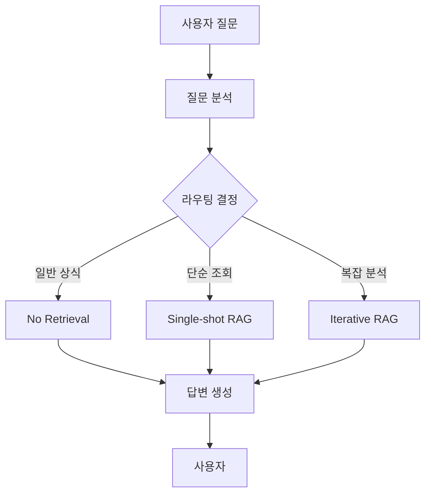

# 재무제표 분석 시스템 v2 - 사용 가이드

## 📋 목차
1. [시작하기](#시작하기)
2. [주요 개선사항](#주요-개선사항)
3. [시스템 아키텍처](#시스템-아키텍처)
4. [실행 방법](#실행-방법)
5. [사용 예시](#사용-예시)
6. [문제 해결](#문제-해결)

## 🚀 시작하기

### 필수 요구사항
- Python 3.8 이상
- OpenAI API 키
- Tavily API 키

### 설치 단계

1. **프로젝트 디렉토리로 이동**
```bash
cd /Users/1107625/dev/repositories/scripts/2509_LLMMVP/MVP/financial_analysis_poc_v2
```

2. **가상환경 생성 및 활성화 (선택사항)**
```bash
python -m venv venv
source venv/bin/activate  # Windows: venv\Scripts\activate
```

3. **필요한 패키지 설치**
```bash
pip install -r requirements.txt
```

4. **환경 변수 설정**
```bash
cp .env.template .env
```

`.env` 파일을 열어 API 키를 입력:
```
OPENAI_API_KEY=sk-...
TAVILY_API_KEY=tvly-...
```

5. **애플리케이션 실행**
```bash
python main.py
```

6. **브라우저에서 접속**
```
http://localhost:7860
```

## ✨ 주요 개선사항

### v1 → v2 개선 내용

#### 1. 벡터 기반 고유명사 검색
**v1의 문제점:**
- 회사명이나 재무항목명의 오타에 취약
- 다양한 표현("SK텔레콤" vs "SKT" vs "에스케이텔레콤")에 대응 어려움

**v2의 해결책:**
```python
# OpenAI Embeddings + InMemoryVectorStore 사용
embeddings = OpenAIEmbeddings(model="text-embedding-3-large")
vector_store = InMemoryVectorStore(embeddings)

# 회사명과 재무항목명을 벡터화하여 저장
companies = ["SK텔레콤", "케이티", "LG유플러스", ...]
items = ["매출액", "영업이익", "당기순이익", ...]
vector_store.add_texts(companies + items)

# 유사도 기반 검색
retriever = vector_store.as_retriever(search_kwargs={"k": 10})
results = retriever.invoke("SKT의 매출")  # "SK텔레콤" 찾음
```

**효과:**
- 오타 허용: "케이티" → "KT", "SK텔래콤" → "SK텔레콤"
- 다양한 표현 지원: "매출" → "매출액", "op" → "영업이익"
- 유사 항목 자동 추천

#### 2. LangGraph StateGraph 기반 Text2SQL

**v1의 구조:**
```
사용자 질문 → SQL Agent → 결과
```

**v2의 구조:**
```
사용자 질문 → 고유명사 벡터 검색 → SQL 쿼리 생성 → 실행 → 답변 생성
     ↓              ↓                    ↓           ↓         ↓
   State      entity_info           SQL Query   DB Result  Answer
```

**코드 예시:**
```python
def write_query(state: State):
    # 고유명사 검색
    entity_info = search_entities(state["question"])
    
    # SQL 쿼리 생성 (고유명사 정보 활용)
    prompt = query_prompt_template.invoke({
        "table_info": db.get_table_info(),
        "entity_info": entity_info,
        "input": state["question"]
    })
    
    return {"query": llm.invoke(prompt)}
```

#### 3. Adaptive RAG 워크플로우

**질문 유형에 따른 자동 라우팅:**

| 질문 유형 | 경로 | 예시 |
|---------|------|------|
| 일반 상식 | No Retrieval | "재무상태표가 뭐야?" |
| 단순 조회 | Single-shot RAG | "삼성전자 매출액은?" |
| 복잡 분석 | Iterative RAG | "SKT와 KT 비교해줘" |

**LangGraph 구조:**


## 🏗 시스템 아키텍처

### 1. 데이터 처리 흐름

```
데이터 파일 (*.txt)
    ↓
Parser (parser.py)
    ↓
SQLite Database (financial_data.db)
    ↓
Vector Store (고유명사 임베딩)
    ↓
Text2SQL Pipeline
```

### 2. Text2SQL 상세 흐름

```python
# 1. 사용자 질문
question = "SK텔레콤의 2025년 상반기 매출액은?"

# 2. 고유명사 벡터 검색
entities = search_entities(question)
# 결과: ["SK텔레콤", "매출액", "LG유플러스", ...]

# 3. SQL 쿼리 생성 (고유명사 정보 포함)
query = """
SELECT 회사명, 항목명, 당기_반기_누적
FROM income_statement
WHERE 회사명 = 'SK텔레콤' 
  AND 항목명 LIKE '%매출%'
"""

# 4. 쿼리 실행
result = db.execute(query)
# 결과: [("SK텔레콤", "매출액", 26800000000000)]

# 5. 답변 생성
answer = "SK텔레콤의 2025년 상반기 매출액은 26조 8천억원입니다."
```

### 3. 주요 컴포넌트

#### database.py
```python
class FinancialDatabase:
    - init_database(): 테이블 생성
    - get_all_companies(): 회사명 목록 반환
    - get_all_items(): 재무항목 목록 반환
```

#### tools.py
```python
class FinancialAnalysisTools:
    - _build_entity_vector_store(): 벡터스토어 구축
    - search_entities(): 고유명사 검색
    - query_financial_data(): Text2SQL 실행
    - search_web(): 웹 검색
```

#### graph.py
```python
class FinancialAnalysisGraph:
    - analyze_query_node(): 질문 분석 및 라우팅
    - no_retrieval_node(): LLM 직접 답변
    - single_shot_rag_node(): 단일 도구 호출
    - iterative_rag_node(): 복합 질문 처리
```

## 💡 사용 예시

### 1. 단순 데이터 조회

**질문:** "SK텔레콤의 매출액은?"

**처리 과정:**
1. 질문 분석 → Single-shot RAG 선택
2. 고유명사 검색: "SK텔레콤" (벡터 유사도 검색)
3. SQL 쿼리 생성:
   ```sql
   SELECT 회사명, 항목명, 당기_반기_누적
   FROM income_statement
   WHERE 회사명 = 'SK텔레콤' AND 항목명 LIKE '%매출%'
   ```
4. 결과 반환: "SK텔레콤의 2025년 상반기 매출액은 26조 8천억원입니다."

### 2. 회사 비교 분석

**질문:** "SKT와 KT의 영업이익률을 비교해줘"

**처리 과정:**
1. 질문 분석 → Iterative RAG 선택
2. 반복 1: SKT 데이터 조회
   - 고유명사: "SK텔레콤", "영업이익"
   - 결과: SKT 영업이익 = 9056억원
3. 반복 2: KT 데이터 조회
   - 고유명사: "케이티", "영업이익"
   - 결과: KT 영업이익 = 8500억원 (예시)
4. 반복 3: 최종 분석
   - 비교 결과 정리 및 인사이트 제공

### 3. 오타/다양한 표현 처리

**질문들:**
- "sk텔래콤의 매출" → ✅ "SK텔레콤" 인식
- "케이티 영업이익" → ✅ "케이티" (KT) 인식
- "op는?" → ✅ "영업이익" (operating profit) 인식
- "삼성 순이익" → ✅ "삼성전자", "당기순이익" 인식

**벡터 검색 덕분에 모두 정확히 인식합니다!**

## 🔧 문제 해결

### 자주 발생하는 오류

#### 1. API 키 오류
```
ValueError: OPENAI_API_KEY가 설정되지 않았습니다.
```

**해결 방법:**
- `.env` 파일이 존재하는지 확인
- API 키가 올바르게 입력되었는지 확인
- 따옴표 없이 키만 입력했는지 확인

#### 2. 데이터베이스 오류
```
데이터베이스 초기화 중 오류 발생
```

**해결 방법:**
- `data/` 폴더에 txt 파일들이 있는지 확인
- 기존 `financial_data.db` 파일 삭제 후 재시도
```bash
rm financial_data.db
python main.py
```

#### 3. 벡터스토어 오류
```
경고: 벡터스토어에 추가할 데이터가 없습니다.
```

**해결 방법:**
- 데이터베이스가 먼저 초기화되어야 함
- 파싱이 정상적으로 완료되었는지 확인
- 로그에서 "데이터 파싱 완료" 메시지 확인

#### 4. 메모리 부족
```
MemoryError: ...
```

**해결 방법:**
- 큰 데이터 파일 처리 시 메모리 부족 가능
- 파일을 분할하여 처리
- 또는 시스템 메모리 증설

## 📊 성능 최적화 팁

### 1. 벡터 검색 최적화
```python
# k 값 조정 (기본값: 10)
retriever = vector_store.as_retriever(search_kwargs={"k": 5})  # 더 빠름
retriever = vector_store.as_retriever(search_kwargs={"k": 20}) # 더 정확함
```

### 2. LLM 모델 선택
```python
# 빠른 응답이 필요한 경우
llm = ChatOpenAI(model="gpt-4o-mini")  # 현재 설정

# 높은 정확도가 필요한 경우
llm = ChatOpenAI(model="gpt-4o")
```

### 3. 캐싱 활용
- 동일한 질문은 캐시에서 바로 반환
- LangGraph의 checkpointer가 자동으로 처리

## 🎯 활용 시나리오

### 시나리오 1: 투자 분석가
```
질문: "통신 3사의 2025년 상반기 실적을 비교해줘"
답변: SK텔레콤, KT, LG유플러스의 매출, 영업이익, 순이익을 표로 정리
```

### 시나리오 2: 재무 담당자
```
질문: "우리 회사의 부채비율 추이를 분석해줘"
답변: 최근 3개년 부채비율 변화 및 원인 분석
```

### 시나리오 3: 일반 투자자
```
질문: "삼성전자 주식 사야할까?"
답변: 재무 데이터 + 웹 검색을 통한 종합 분석
```

## 📝 추가 자료

- [LangChain 공식 문서](https://python.langchain.com/)
- [LangGraph 튜토리얼](https://langchain-ai.github.io/langgraph/)
- [OpenAI API 문서](https://platform.openai.com/docs)
- [Gradio 가이드](https://www.gradio.app/guides)

## 🤝 기여 및 피드백

이 시스템은 계속 개선 중입니다. 피드백이나 제안사항이 있으시면 언제든 알려주세요!

